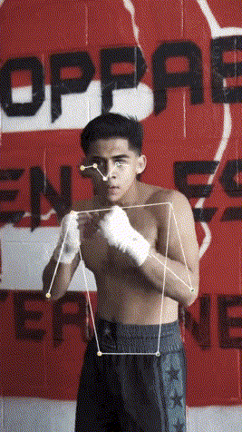

# PBIIBP - Pose-Based Intent Inference Boxing Paradigm

Intent inference based on Google MoveNet Lightning pose data in conjunction with a temporal LSTM model.


## Overview

This project implements a temporal LSTM neural network for inferring boxing intent from pose keypoint sequences. It processes data from Google MoveNet Lightning (17 keypoints with x, y, confidence values = 51 features per frame), calculates kinematic features (such as velocity, acceleration, angle) and classifies boxing actions/intent (in this case: intent to jab).

## Project Structure

```
PBIIBP/
├── src/
│   ├── models/
│   │   ├── __init__.py
│   │   └── temporal_lstm.py    # Core LSTM model
│   ├── data/
│   │   ├── __init__.py
│   │   └── pose_dataset.py     # Data loading and preprocessing
│   └── utils/
│       ├── __init__.py
│       └── training.py         # Training and evaluation utilities
├── requirements.txt
└── README.md
```

## Installation

```bash
pip install -r requirements.txt
```

## Usage

### Basic Model Usage

```python
from src.models import TemporalLSTM
import torch

# Initialize the model
model = TemporalLSTM(
    input_size=51,      # 17 keypoints * 3 (x, y, confidence)
    hidden_size=128,    # LSTM hidden units
    num_layers=2,       # Stacked LSTM layers
    num_classes=4,      # Number of intent classes
    dropout=0.3,
)

# Example input: batch of 8 sequences, 30 frames each, 51 features per frame
x = torch.randn(8, 30, 51)

# Forward pass
logits = model(x)          # Shape: (8, 4)
predictions = model.predict(x)  # Shape: (8,)
```

### Data Processing

```python
from src.data import PoseDataset, create_sequences
import numpy as np

# Create sequences from continuous pose data
pose_data = np.random.randn(1000, 51)  # 1000 frames
labels = np.random.randint(0, 4, 1000)  # 4 classes

sequences, seq_labels = create_sequences(
    pose_data, labels, 
    sequence_length=30, 
    stride=1
)

# Create PyTorch dataset
dataset = PoseDataset(sequences, seq_labels)
```

### Training

```python
from src.models import TemporalLSTM
from src.data import PoseDataset, create_sequences
from src.utils import train_model
from torch.utils.data import DataLoader

# Prepare data
dataset = PoseDataset(sequences, seq_labels)
train_loader = DataLoader(dataset, batch_size=32, shuffle=True)

# Initialize and train model
model = TemporalLSTM(num_classes=4)
history = train_model(
    model, 
    train_loader, 
    epochs=100, 
    learning_rate=0.001
)
```

## Model Architecture

The `TemporalLSTM` model consists of:
- **Input Layer**: Accepts pose sequences of shape (batch, sequence_length, 30)
- **LSTM Layers**: Configurable stacked LSTM layers for temporal processing
- **Fully Connected Layers**: Classification head with dropout regularization
- **Output**: Class logits for intent prediction

## Requirements

- Python 3.7+
- PyTorch >= 1.9.0
- NumPy >= 1.19.0
